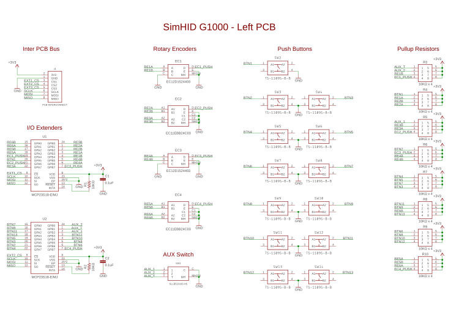
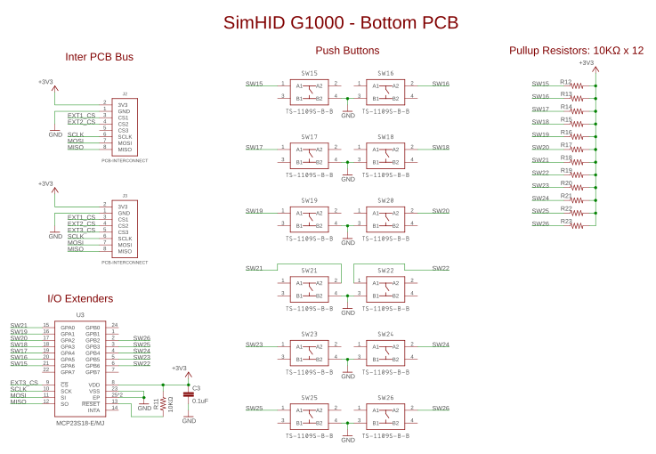
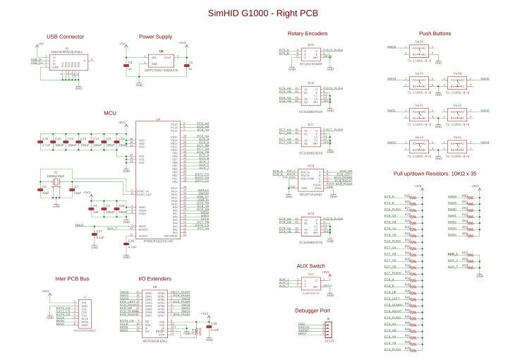

PCBs for SimHID G1000
===

NOTE: |
:----|
SimHID G1000 was designed to apply filve **ALPS EC11EBB24C03** as the dual shaft rotary encoder, however this product is discontinued now. Fortunately, [**BOURNS PEC11D-4120F-20015**](https://www.bourns.com/products/encoders/contacting-encoders/product/PEC11D) can be installed insteaed of **EC11EBB24C03**. This is fully compatible with ALPS product exept shaft geometry. If you install BOURNS PEC11D-4120F-20015, print [another design for dual shaft knobs](https://www.thingiverse.com/thing:5804384).

The operable parts of SimHID G1000, the rotary encoders and push puttons, are distributed and mounted on three PCBs. 
The right board is the main board. The MCU [STM32F411CCU](https://www.st.com/en/microcontrollers-microprocessors/stm32f411cc.html) which is installed on the right board exports USB full speed PHY and communicate with PC via it.
That MCU also observes all operable components state via 16bits SPI I/O expanders, [MCP23S18-E/MJ](https://www.microchip.com/en-us/product/MCP23S18), on each PCB. 
Each PCB is connected with each other via 8-wire interconnect that consists 2 for power supply, 3 for SPI, and 3 for chip select.

I desined these PCBs using [Autodesk Eagle](https://www.autodesk.com/products/eagle/overview) and same functions embedded in [Autodesk Fusion 360](https://www.autodesk.com/products/fusion-360/overview). 
The design files of each PCB and the files required for manufacturing such as gerber data are hosted below.

- [Eagle design files](handsoldering/individuals)
- [PCB.zip](https://raw.githubusercontent.com/wiki/opiopan/simhid-g1000/data/PCB.zip): Files requeired for manufacturing PCB
- [assembly.zip](https://raw.githubusercontent.com/wiki/opiopan/simhid-g1000/data/assembly.zip): Files required for assemble SMT parts on PCB

The above both archive files, PCB.zip and assembly.zip, are complient with the rule of [JLCPCB](https://jlcpcb.com).
You can submit these archive files to [JLCPCB PCB assembly service](https://jlcpcb.com) as it is.  
Please note that the files required to assemble does not indicate all electronic components placement. Following parts are omitted from these files. I assembled these parts by hand-soldering.

Component ID| Product Number        | Remarks
-----------|------------------------|---------------------------
U1, U2, U3, U5 | [MCP23S18-E/MJ](https://www.microchip.com/en-us/product/MCP23S18)
U4         | [STM32F411CCU](https://www.st.com/en/microcontrollers-microprocessors/stm32f411cc.html)
U6         | [MCP1703AT-3302E/CB](https://www.digikey.com/en/products/detail/microchip-technology/MCP1703AT-3302E-CB/3131472)
J1         | [ZX62-B-5PA(33)](https://www.hirose.com/product/p/CL0242-0033-8-33)
J6         | [MOLEX 53047-0410](https://www.molex.com/molex/products/part-detail/pcb_headers/0530470410)| **OPTIONAL**, Necessary only if debugger will be connected
SW1, SW27  | [SLLB510100](https://tech.alpsalpine.com/prod/e/html/multicontrol/switch/sllb5/sllb510100.html)
EC1, EC3, EC5 | [EC12D1524403](https://tech.alpsalpine.com/prod/e/html/encoder/incremental/ec12e/ec12d1524403.html)
EC2, EC4, EC6, EC7, EC9 | [EC11EBB24C03](https://tech.alpsalpine.com/prod/e/html/encoder/incremental/ec11/ec11ebb24c03.html) or [PEC11D-4120F-20015](https://www.bourns.com/products/encoders/contacting-encoders/product/PEC11D)
EC8 | [RKJXT1F42001](https://tech.alpsalpine.com/prod/e/html/multicontrol/switch/rkjxt/rkjxt1f42001.html)

Last but not least, **each PCB thickness should be 1.0mm**. Only in case 1.0mm, the PCB's will be fit to 3D-printed SimHID G1000 housing.

## Schematic Diagram

## BOM List
Components | Value / Product Number | Remarks
-----------|------------------------|------------------------------
U1, U2, U3, U5 | MCP23S18-E/MJ      | 16bits SPI I/O expander
U4         | STM32F411CCU           |
U6         | MCP1703AT-3302E/CB     | SOT-23 LDO
J1         | ZX62-B-5PA(33)         | Hirose Micro USB receptacle connector
J6         | MOLEX 53047-0410       | **OPTIONAL for debugging** Firmware downloading can be proceeded by using DFU mode instead debugger
X1         | 16MHz Crystal (3225)   | load capacitance: 10pF
C1, C2, C3, C9, C10, C11, C12, C13, C14, C15, C17, C19, C20  | 0.1uF (0402)             |
C4, C5, C8 | 1uF (0402)           |
C6, C7     | 22pF (0402)            | need to change value if X1's load capacitance is not 10pF
C16, C18   | 4.7uF (0402)           |
R1, R2, R11, R12, R13, R14, R15, R16, R17,  R18, R19, R20, R21, R22, R23, R24, R25, R26,  R27, R28, R29, R30, R31, R32, R33, R34, R35,  R36, R37, R38, R39, R40, R41, R42, R43, R44,  R45, R46, R47, R48, R49, R50, R51, R52, R53, R54, R55, R56, R57, R58, R59| 10k ohm (0402)         |
R3, R4, R5, R6, R7, R8, R9, R10     | 10k ohm x 4 (0603 x 4) | 
SW1, SW27  | SLLB510100           |
SW2, SW3, SW4, SW5, SW6, SW7, SW8,  SW9, SW10, SW11, SW12, SW13, SW14,  SW15, SW16, SW17, SW18, SW19, SW20,  SW21, SW22, SW23, SW24, SW25, SW26,  SW28, SW29, SW30, SW31, SW32, SW33, SW34 | 4.5mm x 4.5mm tact switch | 4.3mm height
EC1, EC3, EC5 | EC12D1524403 | 1 axis rotary encoder with push button
EC2, EC4, EC6, EC7, EC9 | EC11EBB24C03 or PEC11D-4120F-20015 | 2 axes rotary encoder with push button
EC8 | RKJXT1F42001 | 4 directional joystick with 1 axis rotary encoder and push button

## Supplement
### PCB interconnect
Each PCB are connected to adjacent PCB via the 8 pads janction for interconnect, that are J2, J3, J4 and J5. 
It is recommended to solder the interconnect with the PCBs fixed to the front housing of SimHID G1000 in order to properly adjust the length of the wires connecting between PCBs as below.

